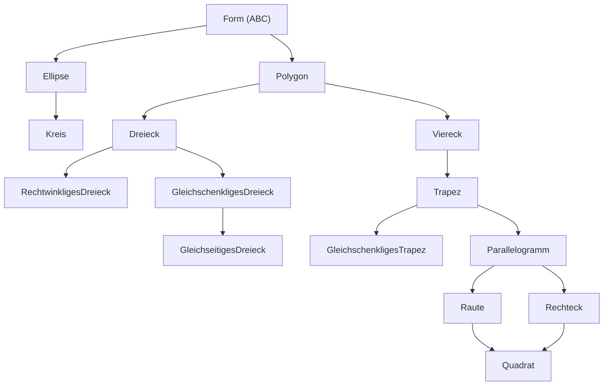

# py-euclid 📐

Eine professionelle, objektorientierte Geometrie-Bibliothek für Python.
Entwickelt mit Fokus auf saubere Architektur (OOP), Unveränderlichkeit (Immutability) und mathematische Präzision.

> **Status:** v0.5.0 (Stable)

## ✨ Features

- **Pure Python:** Keine externen Abhängigkeiten (Zero Dependencies).
- **Objektorientiertes Design:** Logische Vererbungshierarchien.
- **Type Safety:** Durchgängige Nutzung von Type Hints und Dataclasses.
- **Robust:** Unveränderliche primitive Datentypen (`frozen=True`) verhindern Seiteneffekte.
- **Mathematische Präzision:**
    - Flächenberechnung beliebiger Polygone mittels **Gaußscher Trapezformel** (Shoelace Formula).
    - Umfangsberechnung von Ellipsen mittels **Ramanujan-Näherung**.

## 🛠 Installation

Das Projekt ist als installierbares Python-Paket konfiguriert (`pyproject.toml`).

```bash
# 1. Repository klonen
git clone [https://github.com/oliver-devs/py-euclid.git](https://github.com/oliver-devs/py-euclid.git)

# 2. In das Verzeichnis wechseln
cd py-euclid

# 3. Paket installieren (im Editable-Mode)
pip install -e .
```

## 🚀 Verwendung

Nach der Installation kann die Bibliothek in jedem Python-Skript importiert werden.

```python
from geometrie.primitive.elemente import Punkt
from geometrie.figuren.viereck import Drachenviereck, Quadrat, GleichschenkligesTrapez
from geometrie.figuren.ellipse import Kreis

# 1. Punkte definieren (Immutable)
p1 = Punkt(0, 0)

# 2. Komplexe Formen erstellen
# Ein Quadrat ist mathematisch ein Rechteck und eine Raute
quadrat = Quadrat(a=5)
print(f"Fläche Quadrat: {quadrat.flaeche}")  # Ausgabe: 25.0

# 3. Spezielle Formen
# Berechnung via Diagonalen (e, f)
drachen = Drachenviereck(e=10, f=6, abstand_oben=2)
print(f"Fläche Drache:  {drachen.flaeche}")   # Ausgabe: 30.0

# 4. Symmetrische Trapeze (Bonus)
trapez = GleichschenkligesTrapez(a=10, c=6, h=4)
print(f"Fläche Trapez:  {trapez.flaeche}")    # Ausgabe: 32.0

# 5. Runde Formen
kreis = Kreis(zentrum=p1, radius=10)
print(f"Umfang Kreis:   {kreis.umfang:.2f}")  # Ausgabe: 62.83
```

## 🏗 Architektur & Klassenhierarchie

Das Herzstück von `py-euclid` ist die konsequente objektorientierte Struktur.
Das folgende Diagramm visualisiert die **Vererbungshierarchie** (Inheritance Tree) vom abstrakten Basis-Objekt bis zu den spezialisierten Formen.

Es zeigt unter anderem das "Haus der Vierecke" und wie spezialisierte Klassen (z.B. `Quadrat`) Eigenschaften ihrer Elternklassen (`Rechteck`, `Raute`) erben und kombinieren.


